# Глоссарий на FastAPI

Этот проект представляет собой REST API для управления глоссарием с использованием FastAPI и SQLite. Он позволяет добавлять, изменять, удалять и получать термины в глоссарии.

Использование SQLite позволяет не запускать отдельный контейнер с базой данных

## Развёртывание приложения

### Через Docker (рекомендуется)

1. Убедитесь, что у вас установлены Docker и Docker Compose.

2. Запустите сервис:

```bash
docker compose -p glossary up -d
```

Приложение будет доступно по адресу: `http://localhost:8080`

## Внутри базы данных

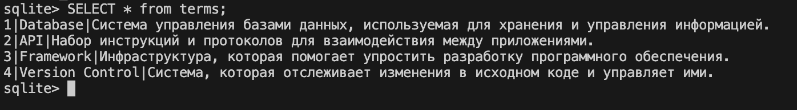

## Функционал

Приложение поддерживает следующие операции:

- **Получение списка всех терминов**: Возможность просмотра полного перечня терминов, доступных в глоссарии.
- **Получение информации о конкретном термине**: Поиск и просмотр подробной информации о термине по его ключевому слову.
- **Добавление нового термина**: Возможность внесения новых терминов в глоссарий с их описанием.
- **Обновление существующего термина**: Редактирование и обновление данных уже имеющихся терминов.
- **Удаление термина из глоссария**: Возможность удаления ненужных или устаревших терминов из системы.

## Работа приложения

После запуска контейнера вы увидите логи запуска приложения:

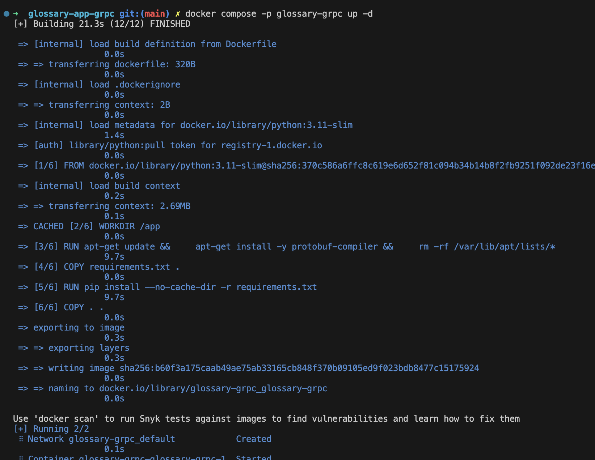

Docker Compose успешно запустит приложение:

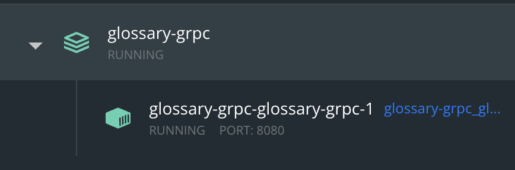

## Использование приложения

Все роуты API документированы в Swagger UI.

### Документация API

- Swagger UI: [http://localhost:8080/docs](http://localhost:8080/docs)

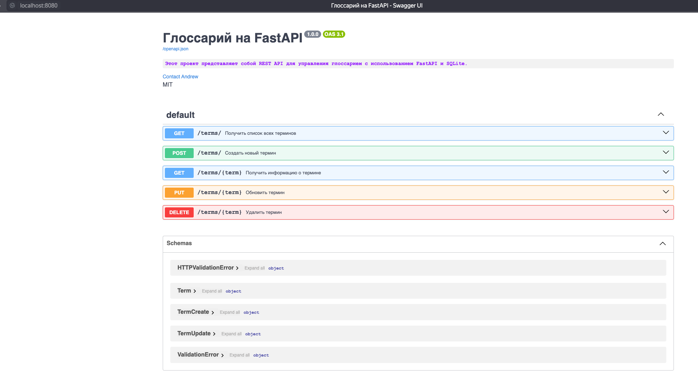

### Примеры запросов

#### Получение всех терминов

```bash
curl http://localhost:8080/terms/
```

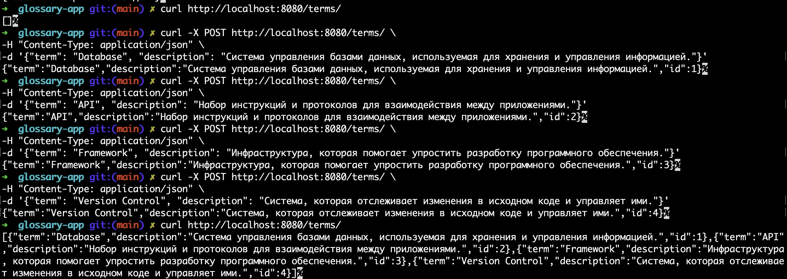

#### Получение конкретного термина

```bash
curl http://localhost:8080/terms/Author
```

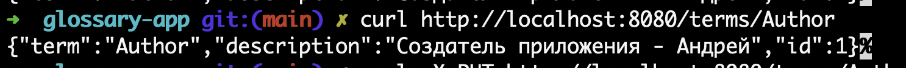

#### Добавление нового термина

```bash
curl -X POST http://localhost:8080/terms/ \
-H "Content-Type: application/json" \
-d '{"term": "Author", "description": "Создатель приложения - Андрей"}'
```

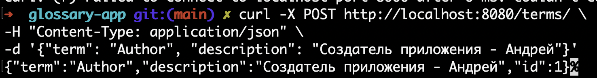

При попытке добавить уже существующий термин:

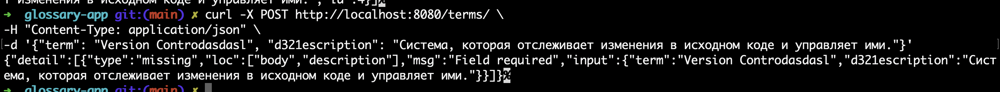

#### Обновление термина

```bash
curl -X PUT http://localhost:8080/terms/Author \
-H "Content-Type: application/json" \
-d '{"description": "Обновлённый термин"}'
```

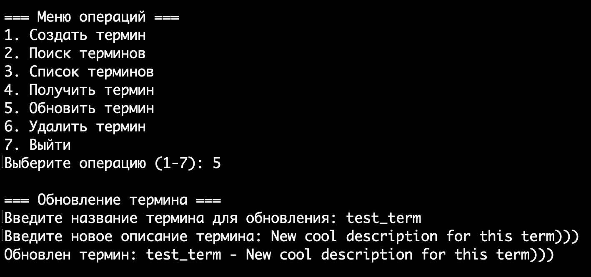

#### Удаление термина

```bash
curl -X DELETE http://localhost:8080/terms/Author
```

Успешное удаление:

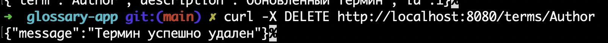

При попытке удалить несуществующий термин:

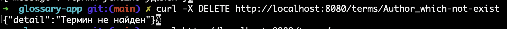

## Заключение

Этот проект предоставляет простой и удобный способ управления глоссарием через REST API. Использование Docker упрощает развёртывание и управление приложением.