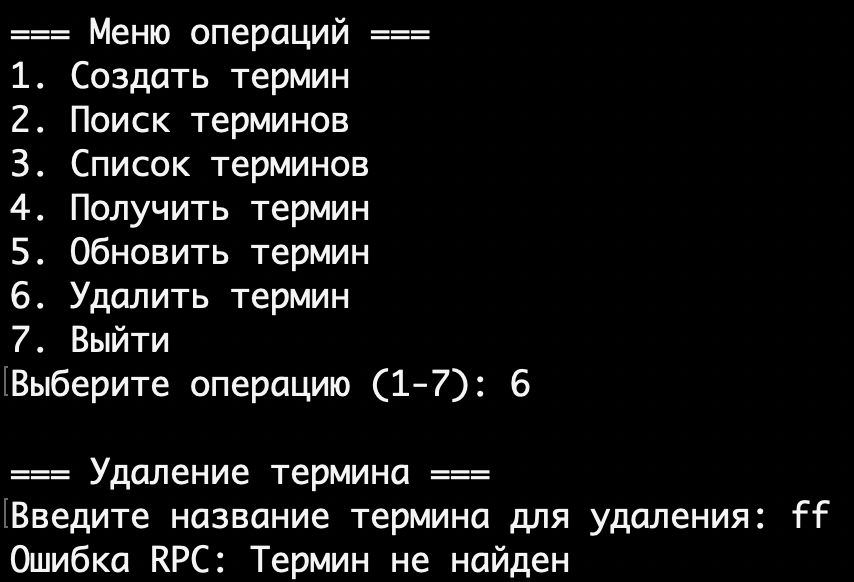

# Глоссарий на gRPC

Этот проект представляет собой gRPC для управления глоссарием с использованием gRPC и SQLite. Он позволяет добавлять, изменять, удалять и получать термины в глоссарии.

Использование SQLite позволяет не запускать отдельный контейнер с базой данных

## Про gRPC

[Про gRPC](https://colab.research.google.com/drive/1ebY2plg9D_QupFdHVBtVqQXO7XpWy7At#scrollTo=kS9-N9dwGsCQ)

## Развёртывание приложения

### Через Docker (рекомендуется)

1. Убедитесь, что у вас установлены Docker и Docker Compose.

2. Запустите сервис:

```bash
docker compose -p glossary-grpc up -d
```

Приложение будет доступно по адресу: `localhost:8080`
Запросы к приложение нужно выполнять через grpc, например, используя клиент console_client.py

## Внутри базы данных


## Функционал

Приложение поддерживает следующие операции:

- ListTerms: Получение списка терминов с пагинацией
- GetTerm: Получение термина по названию
- CreateTerm: Создание нового термина
- UpdateTerm: Обновление существующего термина
- DeleteTerm: Удаление термина
- SearchTerms: Поиск терминов

## Работа приложения

После запуска контейнера вы увидите логи запуска приложения:


Docker Compose успешно запустит приложение:


### Запросы к приложению через консольный клиент

#### Создать термин


#### Поиск терминов по имени


#### Список терминов


#### Получить термин


#### Обновить термин


#### Удалить термин

Успешное удаление:


При попытке удалить несуществующий термин:



## Заключение

Этот проект предоставляет простой и удобный способ управления глоссарием через gRPC. Использование Docker упрощает развёртывание и управление приложением.
